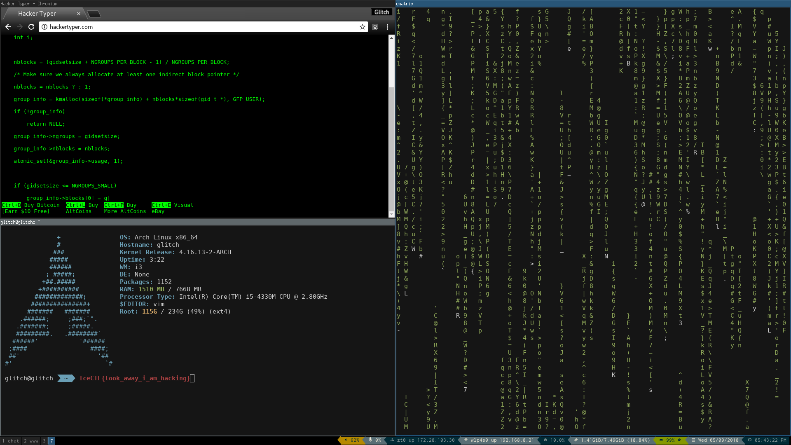

# Hard Shells - Forensics

**Author:** Kaushik S Kalmady

```
After a recent hack, a laptop was seized and subsequently analyzed.
The victim of the hack? An innocent mexican restaurant.
During the investigation they found this suspicous file.
Can you find any evidence that the owner of this laptop is the culprit?
```

We are given a file called `hardshells`.
```bash
$ file hardshells
hardshells: Zip archive data, at least v1.0 to extract
```

We extract it like any other file, but it asks for a password. A simple google search for `hard shells mexican restaurant` is enough to point us to tacos. I enter `tacos` as the password and it works - probably got lucky.

Upon extraction we find another file called `d`. This turned out to be a Minix Filesystem.
```bash
$ file d
d: Minix filesystem, V1, 30 char names, 20 zones
```

We mount it to a local directory.
```bash
$ mkdir tmp
$ sudo mount -o loop -t minix d ./tmp
```

Inside is a file called `dat`. However the `file` command is not able to identify this one.
```bash
$ file dat
dat: data
```

The `file` command checks the magic number which is the initial few bytes of each file to ascertain the file type, rather than looking at the file extension. Considering that it couldn't identify the file type, I assumed the magic number might be corrupt, so checked the initial few bytes in the hexdump.

```bash
$ hexdump -C dat| head -5
00000000  89 50 55 47 0d 0a 1a 0a  00 00 00 0d 49 48 44 52  |.PUG........IHDR|
00000010  00 00 07 80 00 00 04 38  08 06 00 00 00 e8 d3 c1  |.......8........|
00000020  43 00 00 20 00 49 44 41  54 78 9c ec dd 79 78 54  |C.. .IDATx...yxT|
00000030  f5 d5 c0 f1 ef 2c d9 26  fb 0a 49 c8 be b0 98 84  |.....,.&..I.....|
00000040  b0 43 d8 77 14 41 b1 8a  8a 76 51 5b 6d 9f da 6a  |.C.w.A...vQ[m..j|
```

We can see `IHDR`, `IDAT` tags. These are clearly tags found in a PNG file. The initial few bytes are supposed to read `PNG` but are corrupted here to `PUG`. 

We update the initial hex values (you can use `hexedit`, `bless` or `vim` for this) to `89 50 4e 47 0d 0a 1a 0a` which is the PNG magic number.

We can now view the `PNG` image which contains the flag.



## Flag
> IceCTF{look_away_i_am_hacking}
